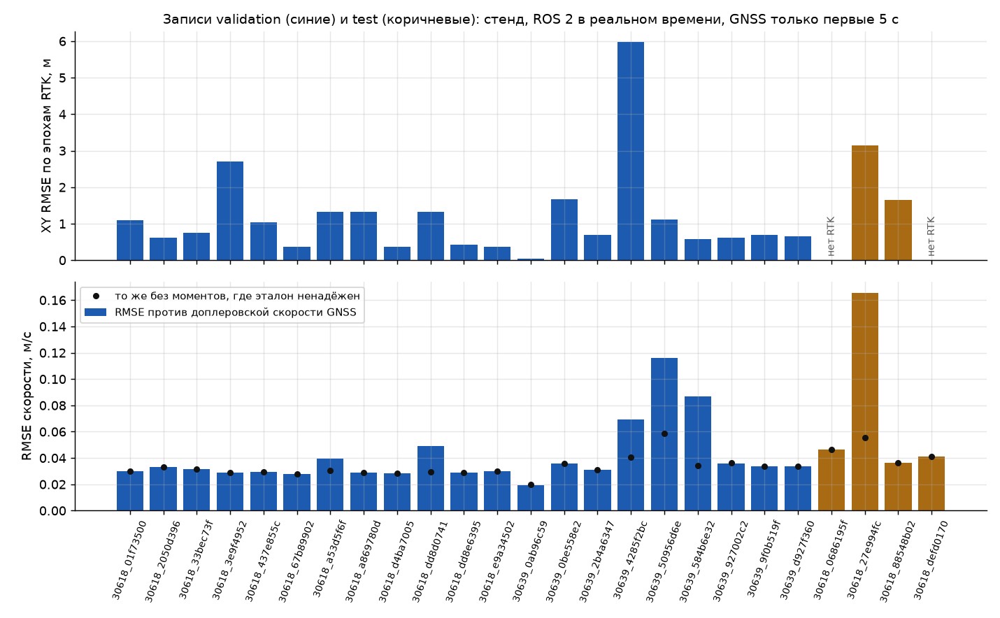
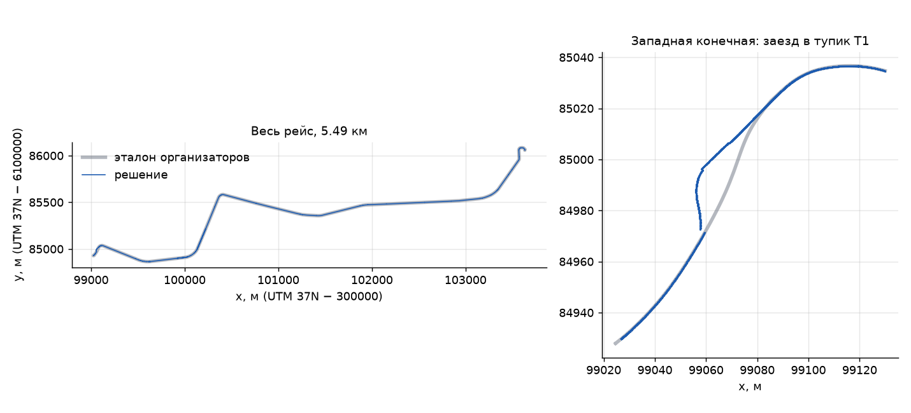
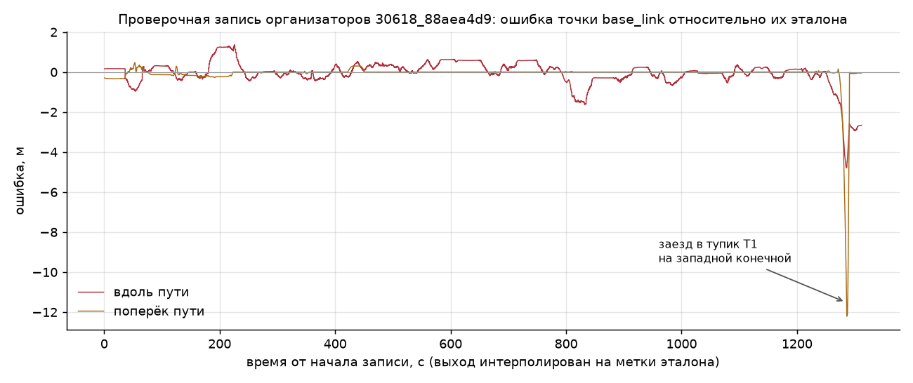

# 5. Точность и быстродействие

## Как мы меряли

Все числа ниже получены одним и тем же способом: нода запускается командой `ros2 launch`, как у жюри, а запись проигрывается в реальном времени. Каждый прогон идёт в отдельном контейнере без сети. Ноде выделено 2 ядра процессора; если она превысит 512 МиБ памяти, её останавливают и прогон считается проваленным. Так мы воспроизводим ограничения из условия.

Ноде достаются только три входных топика (скорости двух тележек и позиция контроллера) и GNSS за первые 5 секунд записи. Остальной GNSS видит только программа оценки: он служит эталоном.

**Эталон скорости.** Скорость по GNSS (доплеровская, от приёмника на крыше вагона, антенна master). Выход ноды сопоставляется с ближайшим по метке времени сообщением GNSS, если они отстоят не больше чем на 0.05 с. Считаем среднеквадратичную ошибку (СКО). Отдельно даём СКО против «чистого» эталона: без моментов, когда два приёмника GNSS на вагоне расходятся по скорости больше чем на 0.5 м/с или метки GNSS сдвинуты больше чем на 0.3 с. В такие моменты ошибается сам эталон.

**Эталон положения.** Координаты GNSS master, перенесённые в точку `base_link` по схеме расположения антенн от организаторов, в той же системе координат, что и выход ноды (UTM 37N со сдвигом). Считаем:
- СКО положения на плоскости (XY) по эпохам, где приёмник сообщает точное решение RTK;
- медиану ошибки XY по всем эпохам;
- конечный дрейф: ошибку положения в конце записи в процентах от пройденного пути.

Даже при статусе RTK эталон иногда прыгает на десятки метров, хотя колёса и доплер показывают ровное движение. Такие эпохи занимают около 2 % времени, но дают около 75 % суммы квадратов ошибки XY. Поэтому самая надёжная оценка точности в таблицах — медиана по записям.

### Как мы построили эталон

Свой эталон (`/localization/kinematic_state`) организаторы дали только в одной проверочной записи `30618_88aea4d9`. В записях датасета его нет, поэтому эталон мы построили сами из GNSS, который есть в каждой записи. Решение этот GNSS после первых 5 с не видит, его читает только программа оценки.

1. Система координат. Фиксы антенны master (широта, долгота, высота WGS84) переводятся в UTM, зона 37N, и сдвигаются: `x = E − 300 000`, `y = N − 6 100 000`, в метрах. Эту систему назвали организаторы. Мы сверили перевод с их примером пересчёта широты и долготы в x, y (совпадение до 0.6 мм) и с их картами путей.
2. Точка `base_link`. По TF организаторов антенна master стоит в 9.873 м позади `base_link`, антенна rover в 2.563 м впереди, между ними 12.436 м. Направление оси вагона берётся по паре фиксов master и rover с одной и той же меткой. Если расстояние в паре отличается от 12.436 м больше чем на 0.3 м, пару считаем скачком фикса и берём направление движения по треку. Точка эталона — фикс master плюс 9.873 м вперёд вдоль оси.
3. Высота. В проверочной записи эталон организаторов лежит на высоте карты путей: медиана разности его z и z карты 0.000 м. Антенна master при этом на 3.10 м выше. Поэтому z нашего эталона равна высоте GNSS минус 3.10 м.
4. Скорость. Эталон скорости — доплеровская скорость антенны master; если её нет, берём rover.
5. Надёжность. Положение сравниваем в первую очередь по эпохам RTK, то есть по фиксам, где приёмник выдал решение с поправками базовой станции (статус 2); без RTK фикс сам ошибается на метры. Для скорости отдельно считаем «чистый» эталон, описанный выше.

На проверочной записи `30618_88aea4d9` точность мы считаем по эталону организаторов и их же скриптом. Сравнить на ней два эталона напрямую почти не удаётся: GNSS в этой записи приходит редкими пачками (438 фиксов master за 22 мин, в основном на стоянках). По высоте они совпадают (медиана разности 0.05 м по эпохам RTK).

**Выборки.** Записи разделены по дням, чтобы проверка шла на днях, которых модель не видела:
- на записях train подбирались все постоянные модели: таблица тяги, пороги, карты, остановки;
- validation — 21 запись 26.08.2026, оба вагона;
- test — 4 записи 03.09.2026, отложены до конца работы. В этот день GNSS хуже: у двух записей нет ни одной эпохи RTK, а сам эталон дня сдвинут примерно на 0.65 м.

Исключения. Записи validation, test и проверочная запись организаторов повлияли на настройку в четырёх местах: задержку `τ` сначала выбрали по validation и затем перепроверили на train; правило подтверждения повторного захвата отпечатка добавлено после ложного захвата на записи test; высота антенны master взята из проверочной записи; постоянные выбора тупика у западной конечной заданы после просмотра validation, test и проверочной записи. Для этих частей оценка не слепая.

## Итоги

Медиана и 90-й процентиль по записям (для test из 4 записей 90-й процентиль совпадает с худшей записью):

| Выборка | Записей | Скорость, СКО, м/с | Скорость против чистого эталона, м/с | XY по эпохам RTK, м | Медиана ошибки XY, м | Конечный дрейф, % пути |
|---|---|---|---|---|---|---|
| validation (26.08) | 21 | 0.032 / 0.069 | 0.031 / 0.036 | 0.69 / 1.68 | 0.35 / 0.45 | 0.012 / 0.043 |
| test (03.09) | 4 | 0.044 / 0.166 | 0.044 / 0.056 | 2.39 / 3.14 | 0.99 / 1.32 | 0.036 / 0.107 |
| реальные эпизоды проскальзывания и юза | 7 | 0.062 / 0.085 | 0.062 / 0.085 | 0.53 / 1.20 | 0.28 / 0.39 | — |

В семи реальных эпизодах проскальзывания и юза из записей скорость в окне самого эпизода ошибается в среднем (медиана) на 0.16 м/с.

**Худшие записи.**
- На validation худший XY у `30639_4285f2bc` — 13.8 м. Это выброс самого эталона: антенна master при статусе RTK прыгает на 38 м за полсекунды, а наша оценка движется ровно.
- Самый большой конечный дрейф на validation у `30639_0be558e2` — 0.32 % пути, около 18 м. Трамвай уходит в тупик на западной конечной и проезжает на 12–18 м дальше конца съёмки этого тупика в нашей карте, а точка остаётся в конце известного участка.
- На test худший XY (9.6 м) у `30618_defd0170`, где у GNSS нет RTK: фиксы обеих антенн скачками возвращаются на 1–50 секунд назад, хотя доплер и колёса показывают движение вперёд. Против эталона без этих скачков ошибка записи — 1.4 м.

## Проверочный рейс организаторов

Организаторы дали одну запись для самопроверки (`30618_88aea4d9`) и свою программу оценки. Мы запускали её под ROS 2 с нашей нодой без изменений:

| Набор сообщений | Положение, 3D СКО, м | Скорость, СКО, м/с | Частота выхода |
|---|---|---|---|
| полный (с позицией контроллера) | 1.05 | 0.055 | 29.3 Гц |
| только пакет сообщений организаторов, без позиции контроллера | 1.09 | 0.040 | 20 Гц |

Первая строка получена на коде этой папки 27.09.2026 (38 438 сопоставленных выходов). Три полных прогона того же кода под ROS 2 дали 1.050, 1.053 и 1.059 м: порядок, в котором ROS 2 доставляет сообщения, немного меняется от прогона к прогону. В прогонах, где нода не получила стартовую пачку записи (см. раздел 2), было 1.11–1.15 м. Вторая строка получена на более ранней версии кода, у которой с контроллером было 1.07 м. Скорости в двух строках напрямую не сравнимы: без контроллера выходы идут на других метках, и скрипт сопоставил 26 081 выход, а не 38 438. Без позиции контроллера нода работает только на колёсах. Колёса сами по себе дают около 9 сообщений в секунду, поэтому между ними нода публикует прогноз по последней оценке, чтобы выход не опускался ниже 20 Гц.

## Сбои, внесённые в записи

Чтобы проверить устойчивость, мы вносили в первые 300 секунд двух записей 12 видов сбоев:
- буксование одной или обеих тележек;
- юз обеих тележек;
- пропадание одной или обеих тележек;
- паузу всех входов;
- нечисловые и нефизичные значения, выбросы;
- дубли и перестановки сообщений;
- скачок меток времени назад, сброс часов источника;
- смесь всего перечисленного.

Все 24 прогона прошли без падений и без нарушения требований к реальному времени. Медиана СКО скорости:

| Сбой | СКО скорости, м/с |
|---|---|
| большинство сценариев | 0.036–0.039 |
| пропуск и пауза | 0.037 и 0.081 |
| буксование одной тележки / обеих | 0.041 / 0.064 |
| скачок меток назад | 0.049 |

## Быстродействие

Требования условия: задержка не больше 100 мс (пик до 250 мс), частота каждого выхода не меньше 10 Гц, 2 ядра, 0.5 ГБ памяти.

| Выборка | Задержка, 95-й процентиль, мс | Задержка, максимум, мс | Частота выхода, Гц | Процессор, ядер (95-й процентиль) | Память, МиБ |
|---|---|---|---|---|---|
| validation | 1.6 (худшая запись 2.8) | 58 (худшая 95) | не меньше 29.0 | 0.10 (до 0.14) | до 106 |
| test | 1.2 (худшая 1.4) | 51 (худшая 59) | не меньше 29.0 | 0.10 (до 0.14) | до 106 |
| эпизоды проскальзывания | 1.7 (худшая 1.9) | 26 (худшая 85) | не меньше 28.1 | 0.12 (до 0.14) | до 106 |
| внесённые сбои | 1.2 (худшая 2.1) | 65 (худшая 95) | не меньше 27.7 | 0.10 (до 0.12) | до 106 |

В ячейках медиана по записям, в скобках худшая запись. Задержка — время от прихода входного сообщения до прихода выхода с той же меткой времени. Максимум 95 мс был в двух прогонах: на записи validation `30618_a53d5f6f` без сбоев и при пропадании передней тележки. При пропадании одной тележки нода ждёт её пару не дольше 50–60 мс, и это ожидание входит в максимум.

Все 56 прогонов прошли все проверки с первой попытки.

## Откуда числа

Таблицы получены 27.09.2026 нашим стендом (Windows 11, Docker Desktop, 16 ядер) на том же коде, что лежит в `src/`: выход совпадает бит в бит. Стенд в эту папку не входит, как он устроен, сказано в [разделе 2](2_jury.md). Полные таблицы по каждой записи и сценарию лежат в `docs/results/`, как их читать, объяснено в `docs/results/README.md`. Проверочный рейс считала программа организаторов `hackathon_solution_checker` под ROS 2.
